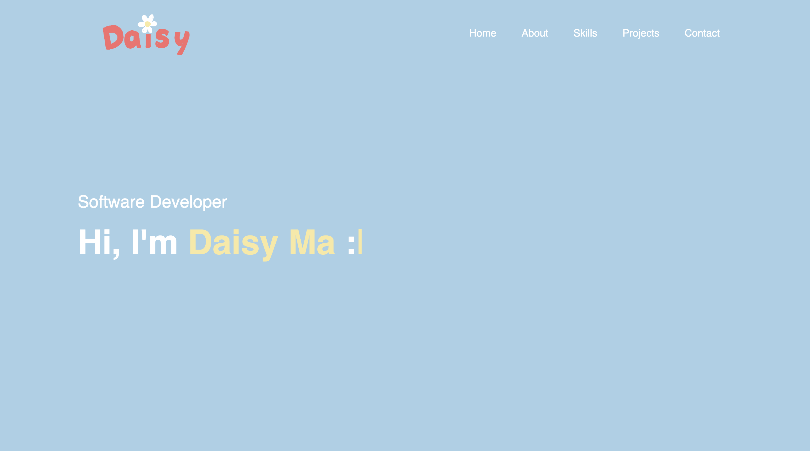
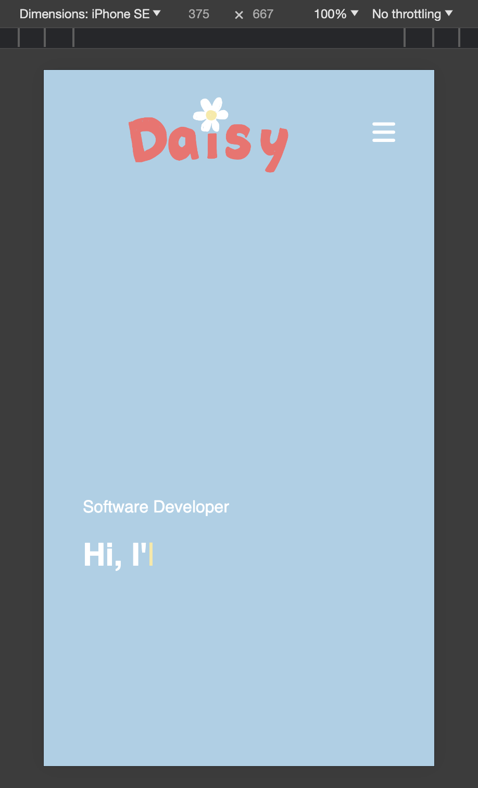
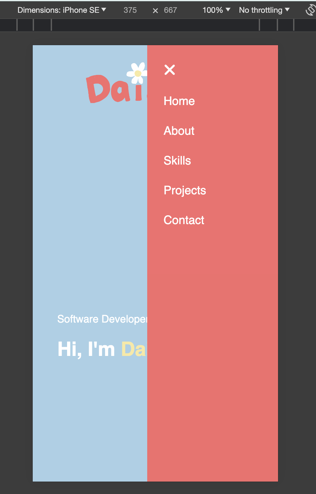
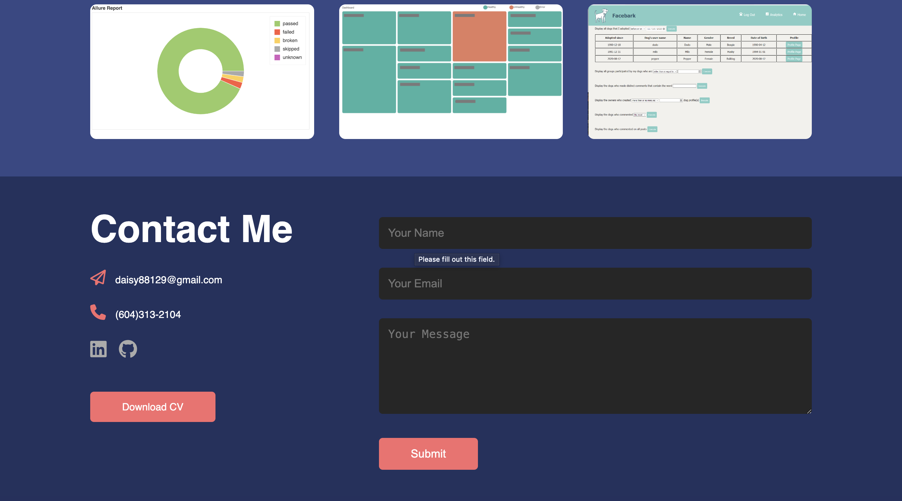

<!-- ABOUT THE PROJECT -->
## About The Project

Welcome to my personal portfolio! Here, I highlight my work experience, skills, educational background, and some projects that represent my expertise and passion in software programming. Feel free to take a look and contact me in the Contact section :laughing:

### Built With
* <i class="fa-brands fa-html5"></i> HTML5
* <i class="fa-brands fa-css3"></i> CSS
* <i class="fa-brands fa-js"></i> Javascript

<!-- USAGE EXAMPLES -->
## Usage

This website is designed to be fully responsive, so it adapts to various screen sizes for optimal viewing experience. On smaller screens, users can navigate through different sections by simply clicking on the menu icon located at the top right corner <i class="fa-solid fa-bars"></i>

In the 'Contact Me' section, you can easily reach out to me by sending a message, which will be received through a Google Form. Additionally, you'll find an option to download my CV for further information. I look forward to connecting with you!

<!-- ROADMAP -->
## Roadmap

- [x] Basic template & styling
- [x] Link input box to google form
- [x] Add timeline design in About section
- [x] Add auto-typing effect to About section
- [x] Responsive adjustments
- [x] style change to introduction section
- [x] Deploy page
- [ ] Add animated animated image to Home page 
- [ ] Change domain name
- [ ] Turn into a React App

<!-- ACKNOWLEDGMENTS -->
## Acknowledgments

These are some resources I would like to give credit to.

* [Submit a Form to Google Sheets](https://github.com/jamiewilson/form-to-google-sheets)
* [A JavaScript Typing Animation Library](https://github.com/mattboldt/typed.js/)
* [GreatStack videos](https://www.youtube.com/@GreatStackDev)
* [Font Awesome](https://fontawesome.com)

(<a href="#readme-top">back to top</a>)
